# Báo cáo thực hành IoT — YoloUNO (ESP32-S3)

> Tài liệu ghi chú kỹ thuật cho 6 task thực hành. Ảnh minh chứng sẽ được bổ sung vào các ô `[📷 ẢNH]` sau khi thực hiện.

---

## Tổng quan dự án

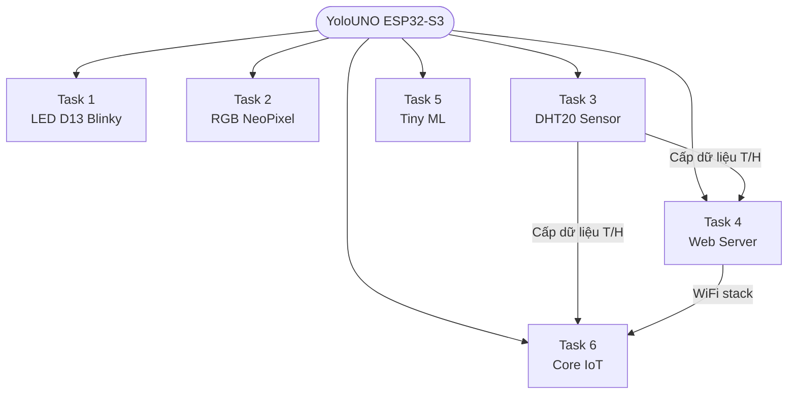

---

## Phần cứng — YoloUNO

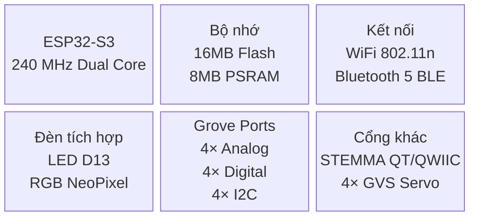

---

## Task 1: Chớp tắt đèn D13 (LED Blinky)

### Mô tả

Điều khiển đèn LED tích hợp trên chân **D13** nhấp nháy liên tục với chu kỳ 500 ms bật — 500 ms tắt. Đây là chương trình "Hello World" của lập trình nhúng, xác nhận môi trường Arduino IDE đã cài đúng và board hoạt động bình thường.

### Luồng hoạt động

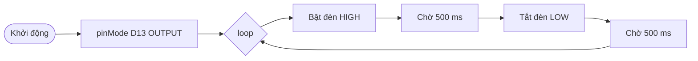

### Giải thích kỹ thuật

| Thành phần | Vai trò |
|-----------|--------|
| `LED_BUILTIN` | Macro trỏ đến GPIO D13; dùng thay số cứng để code portable |
| `pinMode OUTPUT` | Khai báo chân là ngõ ra số |
| `digitalWrite HIGH/LOW` | Cấp / ngắt điện cho LED |
| `delay(500)` | Tạo chu kỳ nhấp nháy 1 Hz (500 ms on, 500 ms off) |

### Cải tiến có thể áp dụng

- Thay `delay()` bằng `millis()` để vòng lặp không bị block (non-blocking blink), cho phép xử lý tác vụ khác song song.
- Thêm biến `blinkInterval` để có thể thay đổi tốc độ nhấp nháy mà không cần biên dịch lại.

### Ảnh minh chứng

| Nội dung | Ảnh |
|---------|-----|
| YoloUNO đang chạy — đèn D13 sáng | `[📷 ẢNH]` |
| Màn hình Arduino IDE | `[📷 ẢNH]` |

---

## Task 2: Chớp tắt đèn RGB (RGB Blinky)

### Mô tả

Điều khiển đèn **RGB NeoPixel** tích hợp (chuẩn WS2812) chuyển màu liên tục theo vòng **Đỏ → Xanh lá → Xanh dương → Tắt**, mỗi trạng thái duy trì 400 ms, sử dụng thư viện **Adafruit NeoPixel**.

### Luồng hoạt động

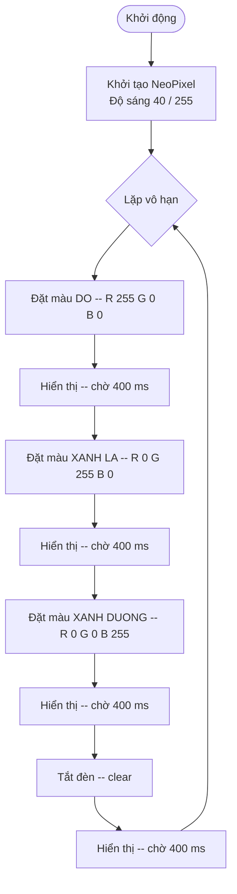

### Giao tiếp NeoPixel (WS2812)

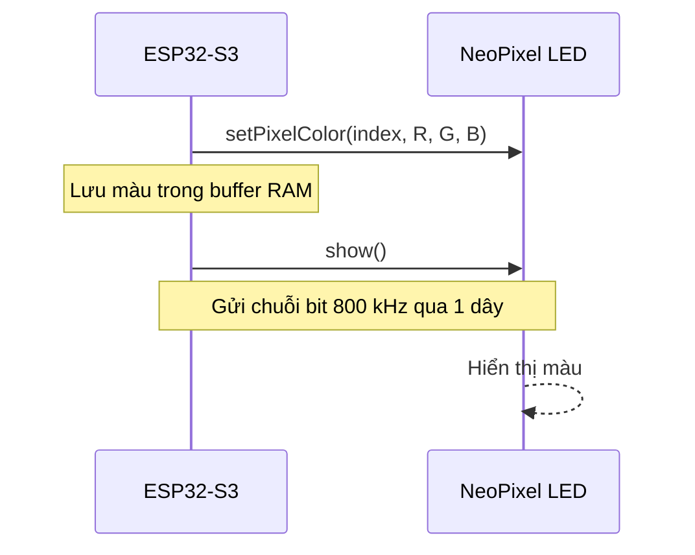

### Giải thích kỹ thuật

| Thành phần | Vai trò |
|-----------|--------|
| `RGB_NEOPIXEL_PIN` | Chân dữ liệu 1-wire; thử pin `48` hoặc `38` (onboard), `3` cho Grove D3 |
| `setBrightness(40)` | Giới hạn độ sáng 0–255; giá trị 40 ≈ 16% để tránh chói |
| `setPixelColor(idx, Color(R,G,B))` | Ghi màu vào buffer; chưa hiển thị ngay |
| `show()` | Truyền buffer ra LED qua giao thức 1-wire; bắt buộc gọi sau khi đổi màu |
| `clear()` | Đặt tất cả LED về 0,0,0 trong buffer |

### Cải tiến có thể áp dụng

- Thêm hiệu ứng **fade** (tăng/giảm dần từng kênh R/G/B) để chuyển màu mượt mà hơn.
- Dùng `millis()` thay `delay()` để chạy đa nhiệm (e.g. vừa chuyển màu vừa đọc cảm biến).
- Mở rộng sang module NeoPixel nhiều LED (thay `NUM_PIXELS`).

### Ảnh minh chứng

| Nội dung | Ảnh |
|---------|-----|
| Đèn RGB màu đỏ | `[📷 ẢNH]` |
| Đèn RGB màu xanh lá / xanh dương | `[📷 ẢNH]` |
| Màn hình Arduino IDE | `[📷 ẢNH]` |

---

## Task 3: DHT20 — Đọc nhiệt độ & độ ẩm

### Mô tả

Kết nối cảm biến **DHT20** qua giao tiếp **I2C** (địa chỉ `0x38`), đọc nhiệt độ và độ ẩm mỗi 2 giây, in kết quả ra Serial Monitor. Thư viện: **DHT20** của Rob Tillaart.

### Sơ đồ kết nối

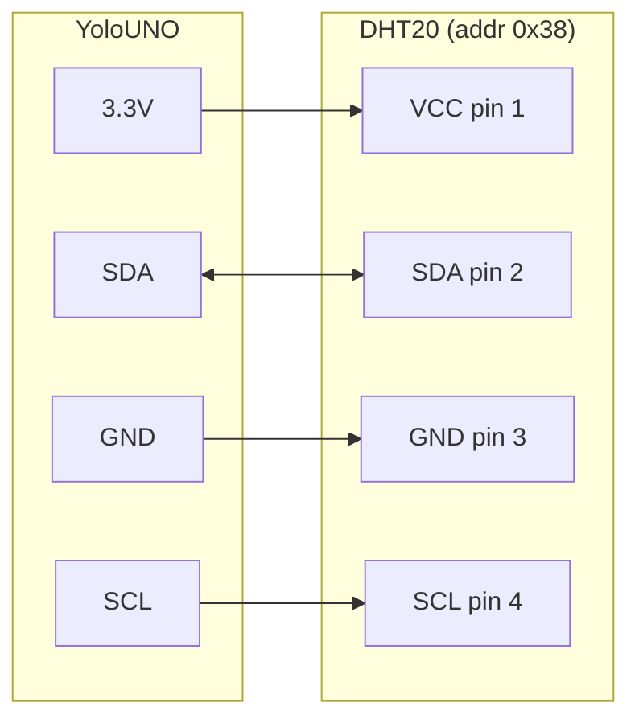

### Luồng đọc dữ liệu

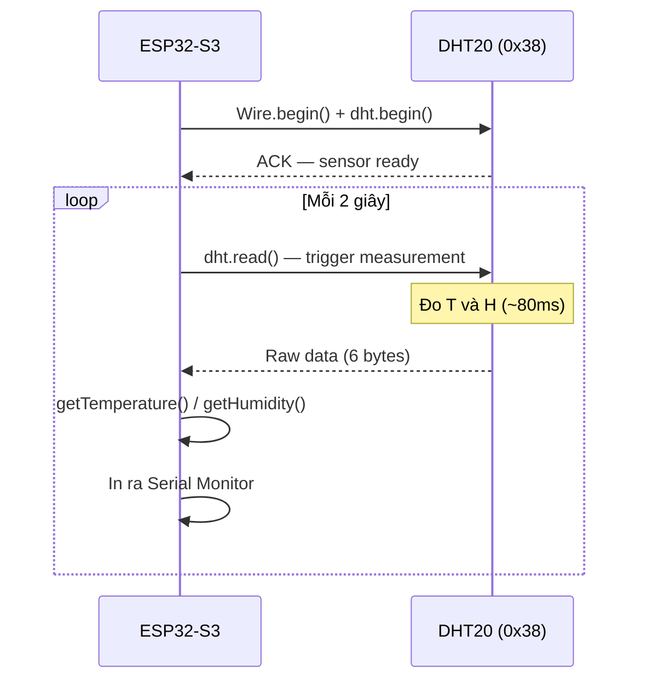

### Giải thích kỹ thuật

| Hàm | Vai trò |
|-----|--------|
| `Wire.begin()` | Khởi tạo bus I2C phần cứng |
| `dht.begin()` | Xác nhận DHT20 tồn tại trên bus; trả về `true` nếu OK |
| `dht.read()` | Gửi lệnh đo + đọc 6 byte kết quả; trả về `0` nếu thành công |
| `dht.getTemperature()` | Trả về float nhiệt độ (°C) từ lần đo gần nhất |
| `dht.getHumidity()` | Trả về float độ ẩm (%RH) từ lần đo gần nhất |

**Đặc tính cảm biến DHT20:**

| Thông số | Giá trị |
|---------|--------|
| Giao tiếp | I2C, địa chỉ 0x38 |
| Điện áp | 2.2 V – 5.5 V |
| Dải nhiệt độ | −40 °C đến +80 °C (±0.5 °C) |
| Dải độ ẩm | 0 – 100 %RH (±3%) |
| Thời gian đo | ~80 ms |

### Cải tiến có thể áp dụng

- Thêm kiểm tra ngưỡng: cảnh báo LED hoặc buzzer khi nhiệt độ > 35 °C hoặc độ ẩm > 80%.
- Lưu lịch sử giá trị đo vào mảng để tính trung bình trượt (moving average), giảm nhiễu.

### Ảnh minh chứng

| Nội dung | Ảnh |
|---------|-----|
| YoloUNO + DHT20 đã kết nối dây | `[📷 ẢNH]` |
| Serial Monitor hiển thị giá trị đo | `[📷 ẢNH]` |

---

## Task 4: Web Server

### Mô tả

YoloUNO kết nối **WiFi (STA mode)** và khởi chạy **HTTP server trên cổng 80**. Người dùng mở trình duyệt → nhập IP của board → nhận trang web hiển thị trạng thái thiết bị và số liệu cảm biến, tự động làm mới mỗi 3 giây.

### Kiến trúc kết nối

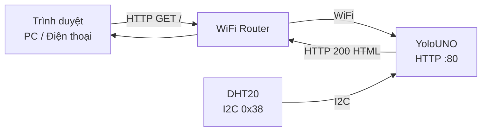

### Luồng xử lý request

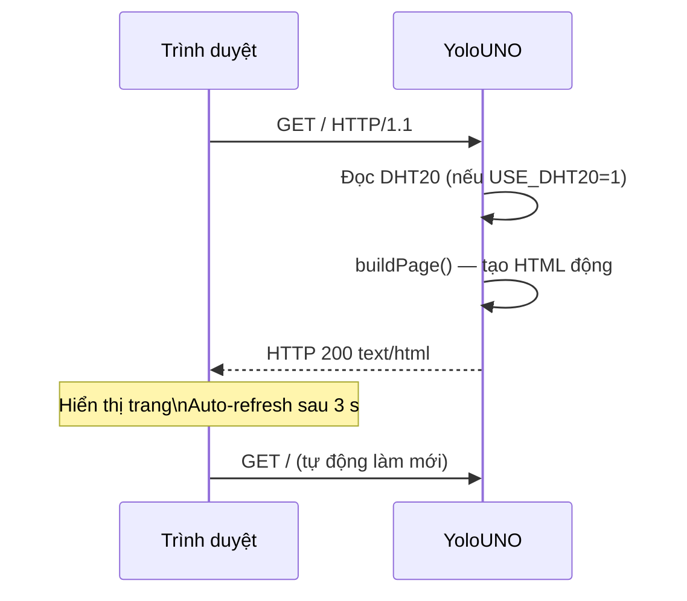

### Giao diện web (mô phỏng)

```
┌──────────────────────────────────┐
│        YoloUNO WebServer         │
├──────────────────────────────────┤
│  Status    :  online             │
│  IP        :  192.168.x.xxx      │
│  ──────────────────────────────  │
│  Temperature :  26.45 °C        │
│  Humidity    :  68.30 %RH       │
├──────────────────────────────────┤
│  ⟳ Tự động làm mới sau 3 giây   │
└──────────────────────────────────┘
```

### Chức năng chi tiết

| Chức năng | Mô tả |
|----------|------|
| WiFi STA | Kết nối vào router/hotspot bằng SSID + password |
| HTTP GET `/` | Trả về trang HTML đầy đủ với dữ liệu thực |
| Auto-refresh | Meta tag `refresh=3` làm mới trang mỗi 3 giây |
| DHT20 tùy chọn | `USE_DHT20 = 1/0` bật/tắt đọc cảm biến |
| Xử lý lỗi sensor | Nếu DHT20 lỗi, trang vẫn hiển thị với thông báo lỗi |

### Cải tiến có thể áp dụng

- Sử dụng **AsyncWebServer** thay WebServer blocking để xử lý nhiều client đồng thời.
- Thêm route `/api/sensor` trả về JSON (REST API) cho frontend hiện đại.
- Thêm nút điều khiển LED ngay trên trang web (kết hợp với Task 1/2).

### Ảnh minh chứng

| Nội dung | Ảnh |
|---------|-----|
| Trang web trên trình duyệt (có dữ liệu T/H) | `[📷 ẢNH]` |
| Serial Monitor sau khi kết nối WiFi (hiển thị IP) | `[📷 ẢNH]` |
| Board YoloUNO đang chạy | `[📷 ẢNH]` |

---

## Task 5: Tiny ML

### Mô tả

Chạy mô hình **Machine Learning nhỏ (TensorFlow Lite Micro)** trực tiếp trên chip ESP32-S3 — hoàn toàn **offline, không cần cloud**. Demo: phân loại hoa **Iris** (4 đặc trưng đầu vào → 3 class) với mô hình ~5 KB. Kết quả in ra Serial và đèn D13 nhấp theo số class.

### Kiến trúc TinyML trên thiết bị

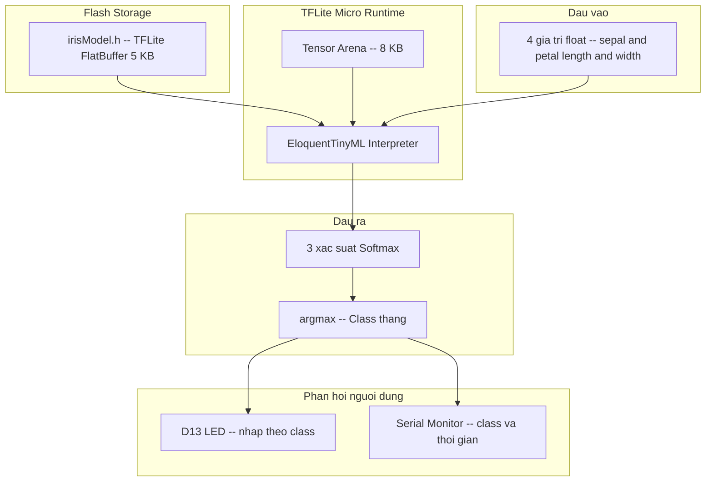

### Mô hình Iris — kiến trúc mạng

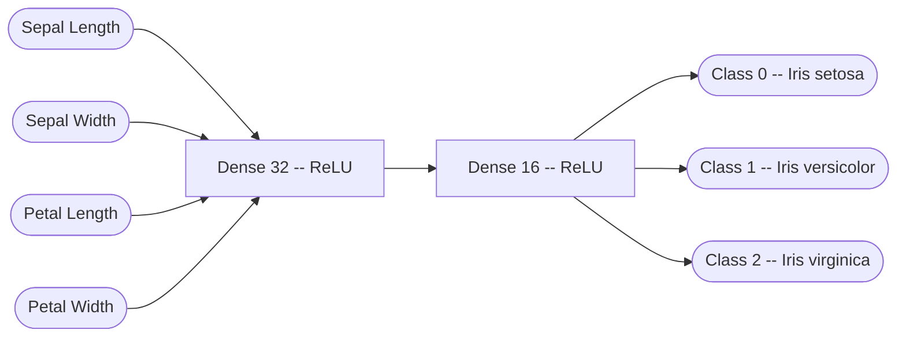

### Ý nghĩa class

| Class | Loài hoa | Đặc điểm nhận dạng |
|-------|---------|-------------------|
| 0 | *Iris setosa* | Cánh hoa nhỏ, đài hoa rộng |
| 1 | *Iris versicolor* | Kích thước trung bình |
| 2 | *Iris virginica* | Cánh hoa lớn nhất |

### Phản hồi kết quả

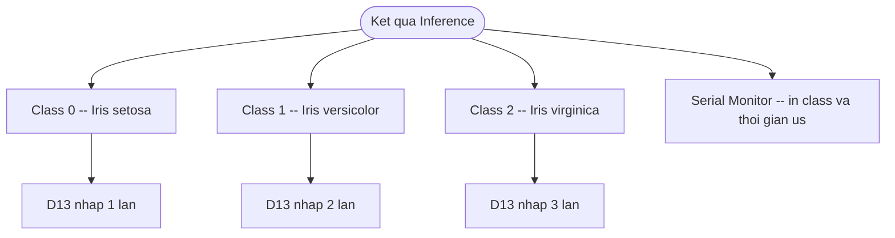

### Thông số kỹ thuật

| Tham số | Giá trị |
|--------|--------|
| Input | 4 float (sepal/petal length & width, đã chuẩn hóa 0–1) |
| Output | 3 float (softmax xác suất) |
| Model size | ~5 KB (FlatBuffer) |
| Tensor arena | 8 KB |
| Inference time | ~8,000–10,000 μs (~8–10 ms) trên ESP32-S3 |
| Thư viện | EloquentTinyML + tflm_esp32 |

### Cải tiến có thể áp dụng

- Tăng `ARENA_SIZE` nếu gặp lỗi "AllocateTensors failed" với mô hình phức tạp hơn.
- Thay `irisModel.h` bằng mô hình từ **Edge Impulse** (phân loại cử chỉ, nhận dạng âm thanh từ microphone).
- Thêm RGB NeoPixel phản hồi màu theo class (đỏ / xanh / lam thay vì nhấp LED).

### Ảnh minh chứng

| Nội dung | Ảnh |
|---------|-----|
| Serial Monitor — kết quả inference (class + time) | `[📷 ẢNH]` |
| D13 LED nhấp nháy phản hồi class | `[📷 ẢNH]` |
| Board YoloUNO đang chạy | `[📷 ẢNH]` |

---

## Task 6: Core IoT

### Mô tả

Kết nối YoloUNO tới nền tảng **Core IoT** ([coreiot.io](https://coreiot.io)) qua giao thức **MQTT**. Board gửi dữ liệu cảm biến lên cloud, đồng thời nhận lệnh điều khiển từ Dashboard.

### Kiến trúc hệ thống

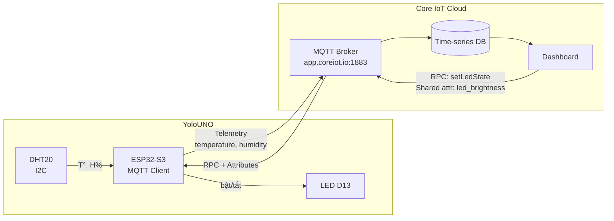

### Luồng dữ liệu đầy đủ

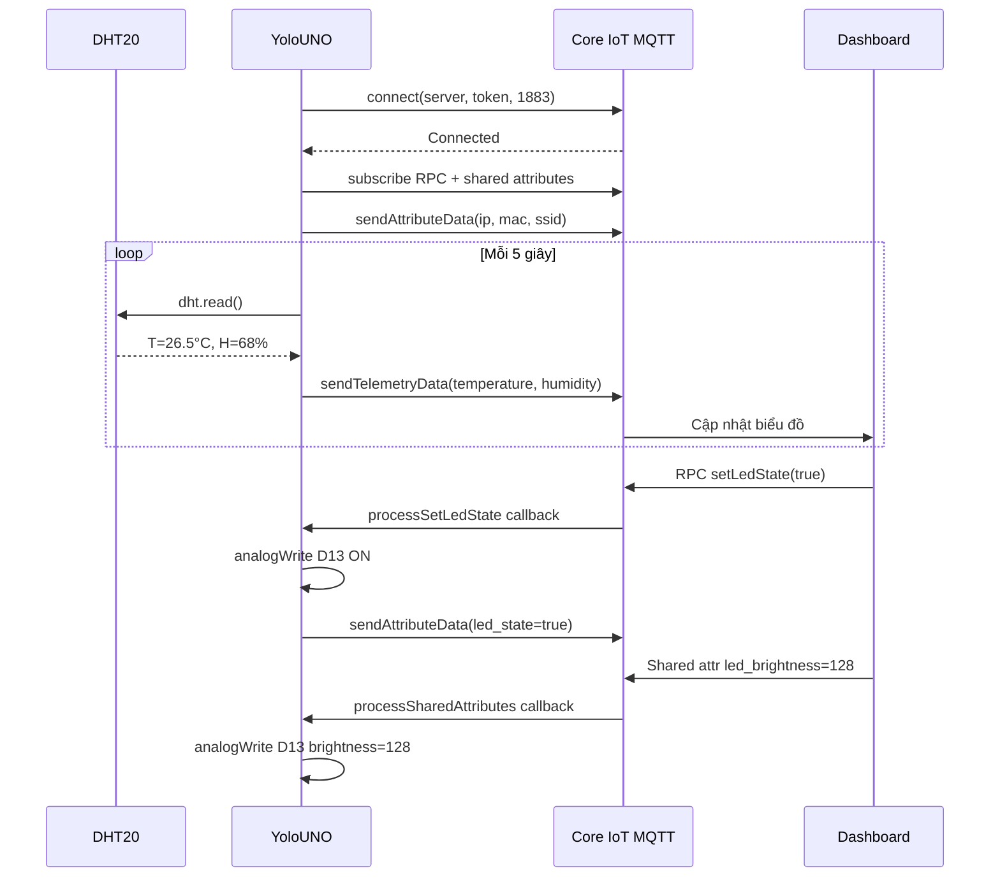

### Dữ liệu trao đổi

| Tên | Loại | Hướng | Ý nghĩa |
|-----|------|-------|--------|
| `temperature` | Telemetry | Board → Cloud | Nhiệt độ (°C) |
| `humidity` | Telemetry | Board → Cloud | Độ ẩm (%RH) |
| `rssi` | Attribute | Board → Cloud | Cường độ tín hiệu WiFi (dBm) |
| `ip_address` | Attribute | Board → Cloud | Địa chỉ IP hiện tại |
| `mac_address` | Attribute | Board → Cloud | Địa chỉ MAC |
| `led_state` | Client attr | Hai chiều | Trạng thái đèn (bool) |
| `led_brightness` | Shared attr | Cloud → Board | Độ sáng đèn (0–255) |

### Các bước thiết lập CoreIoT

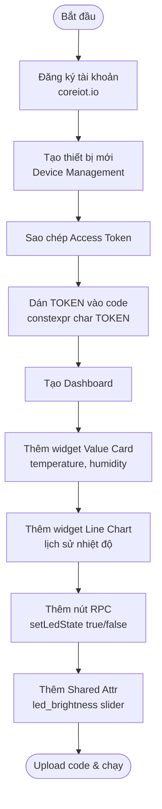

### Cải tiến có thể áp dụng

- Thêm **cảnh báo (Alert)** trên CoreIoT khi nhiệt độ vượt ngưỡng (Rule Engine).
- Gửi thêm dữ liệu `uptime` (thời gian hoạt động) để giám sát độ ổn định.
- Mã hóa kết nối bằng **MQTT over TLS (port 8883)** cho môi trường production.

### Ảnh minh chứng

| Nội dung | Ảnh |
|---------|-----|
| Dashboard CoreIoT — biểu đồ nhiệt độ & độ ẩm | `[📷 ẢNH]` |
| Nút RPC bật/tắt đèn trên Dashboard | `[📷 ẢNH]` |
| YoloUNO kết nối server + Serial Monitor "Connected" | `[📷 ẢNH]` |
| Board nhận lệnh RPC — đèn D13 bật/tắt | `[📷 ẢNH]` |

---

## GitSource

| Thông tin | Chi tiết |
|----------|---------|
| **Repository** | [github.com/minhducnt/iot-lab-yolouno](https://github.com/minhducnt/iot-lab-yolouno) |
| **Branch** | `main` |
| **Ngôn ngữ** | C++ (Arduino IDE / ESP32 core) |

### Cấu trúc repository

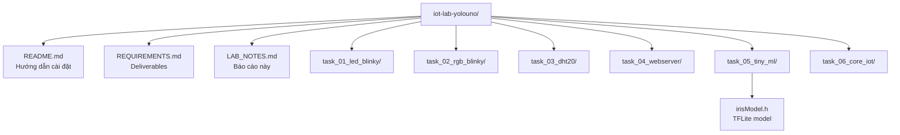

---

## Tóm tắt thư viện

| Thư viện | Nguồn cài | Task |
|---------|----------|------|
| ESP32 / OhStem core | Boards Manager | Tất cả |
| **Adafruit NeoPixel** ≥ 1.11 | Library Manager | 2 |
| **DHT20** — Rob Tillaart ≥ 0.3.2 | Library Manager | 3, 4, 6 |
| **WebServer** (built-in) | ESP32 core | 4 |
| **EloquentTinyML** | Library Manager | 5 |
| **tflm_esp32** | Library Manager | 5 |
| **Core IoT – ThingsBoard** ≥ 4.x | OhStem board pkg / ZIP | 6 |
